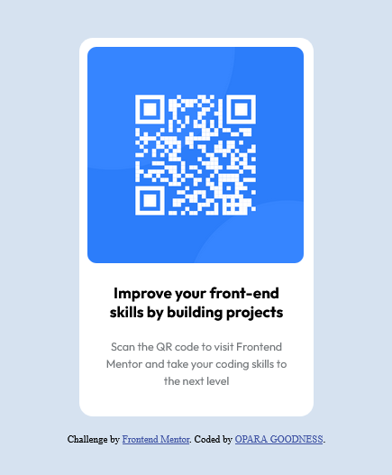

# Frontend Mentor - QR code component solution

This is a solution to the [QR code component challenge on Frontend Mentor](https://www.frontendmentor.io/challenges/qr-code-component-iux_sIO_H). Frontend Mentor challenges help you improve your coding skills by building realistic projects. 

## Table of contents

- [Overview](#overview)
  - [Screenshot](#screenshot)
  - [Links](#links)
- [My process](#my-process)
  - [Built with](#built-with)
  - [What I learned](#what-i-learned)
  - [Continued development](#continued-development)
  - [Useful resources](#useful-resources)
- [Author](#author)
- [Acknowledgments](#acknowledgments)

## Overview

### Screenshot
Here is the file path to my screenshot. 

### Links

- Solution URL: [Add solution URL here](https://your-solution-url.com)
- Live Site URL: [Add live site URL here](https://imosfinest.github.io/QR-code-component/)

## My process
- I started this project first by structuring my html.
- Did my stying first by using the internal style, then I finally completed the project with the external styling.
- Adjusted my html structure as I noticed that some styles weren't taking effect.
- Had a little challenge with the favicon but I eventually got the path correctly.
- Centering my container was another big challenge for me.. but finnaly I made it happen.

### Built with

- Semantic HTML5 
- CSS
- Mobile-first workflow

### What I learned

I learnt how to properly center my container. I did alot of adjustment at this point but it gave me joy at the end.

```css
.QRcode {
  height: 420px;
  width: 260px;
  margin: 40px auto;
}
```

### Continued development

I'll like to improve more on semantic html, focus on responsiveness and using variables when styling.

I was able to assit a track mate complete this project and I am happy I have come this far.

### Useful resources

- [Resource 1](https://www.codecademy.com/) - This helped me understand block-sizing and centering of my container.. I really liked how it was taught and  will use it going forward.
- [Resource 2](https://developer.mozilla.org/en-US/) - This is an amazing article which helped me finally understand CSS UNIT AND VALUES. I'd recommend it to anyone still learning this concept.

## Author

- Website - [Add your name here](https://www.your-site.com)
- Frontend Mentor - [@yourusername](https://www.frontendmentor.io/profile/imosfinest)
- Twitter - [@yourusername](https://www.twitter.com/@imosfinest)

## Acknowledgments

- RAPHEAL AKPAN the very one that adviced and suggested this career path to me...I want to say a very big thank you.
- To my @techathon community thank you for much so much for giving me the environment to trive.


